# Alkalmazások fejlesztése 1. beadandó

Téma: Családi TODO

## Követelmény-analízis

### Követelmények
- #### Funkcionális elvárások
	- Látogatóként regisztráció az oldalra
	- Látogatóként bejelentkezés az oldalra
	- Felhasználóként a feladatok megtekintése
	- Felhasználóként feladat kiírása
	- Felhasználóként feladat szerkesztése
	- Szülőként feladat törlése
	- Főoldalon az alkalmazás ismertetése

- #### Nem-funkcionális elvárások
    - Felhasználóbarát kinézet
    - Hatákonyság
    - Biztonságos működés: jogosultságok megfelelő ellenőrzése, jelszavak titkosított tárolása

### Használatieset-modell

- #### Szerepkörök
	1. Vendég
		- főoldal megtekintése
		- bejelentkezés
		- regisztráció
        
    2. Felhasználó
        - Vendég szerepköre
        - feladatok megtekintése
        - a neki szánt feladatok állapotának módosítása

    3. Admin
        - Felhasználó szerepköre
        - feladat teljeskörű szerkesztése
        - feladat törlése

- #### Használatieset diagram
    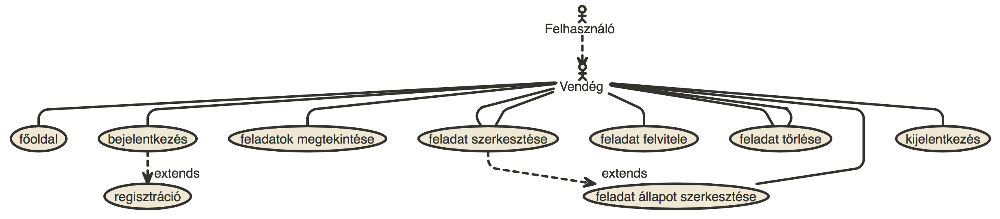

- #### Folyamatok pontos menete
    1. Új feladat 
    2. Feladat módosítás 
    3. Feladat törlés 

## Tervezés

### Architektúra terv
- #### Oldaltérkép
	- **Publikus:**
	    - Főoldal
	    - Bejelentkezés
	    - Regisztráció
	    
	- **Bejelentkezve:**
	    - Főoldal
	    - Kijelentkezés
	    - Feladatok listája
	        + új feladat
	        + feladat szerkesztése
	        + feladat törlése (adminként)

- #### Végpontok
    - GET /: főoldal
    - GET /login: bejelentkezés
    - POST /login: bejelentkezési adatok feldolgozása
    - GET /logout: kijelentkezés
    - GET /signup: regisztráció
    - POST /signup: regisztrációs adatok feldolgozása
    - GET /todos/list: feladatok listázása
    - GET /todos/new: új feladat bejegyzése
    - POST /todos/new: újonnan bejegyzett adat feldolgozása
    - GET /todos/edit/id: feladat szerkesztése
    - POST /todos/edit/id: szerkesztett adat feldolgozása
    - GET /todos/delete/id: feladat törlése

### Felhasználóifelület-modell
- #### Oldalvázlatok
    - Főoldal
        
    - Bejelentkezés
        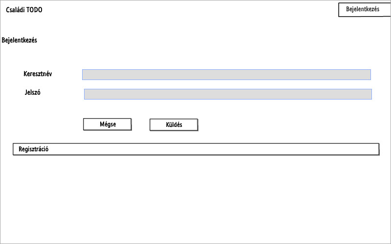
    - Regisztráció
        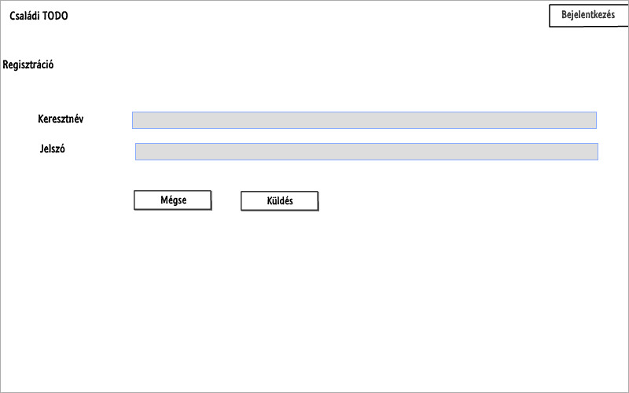
    - Feladatok
        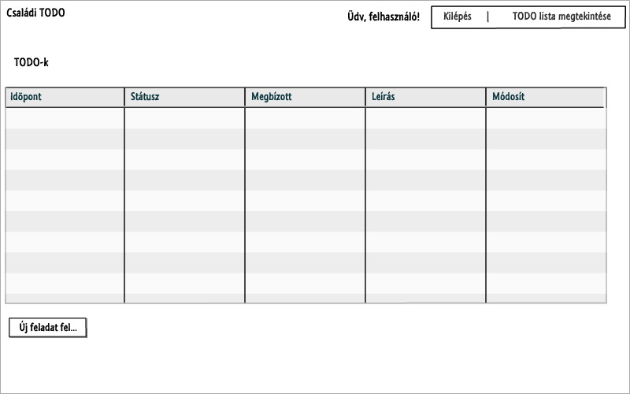
    - Új feladat
        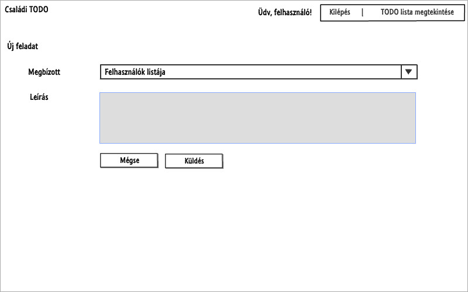
    - Feladat módosítás
        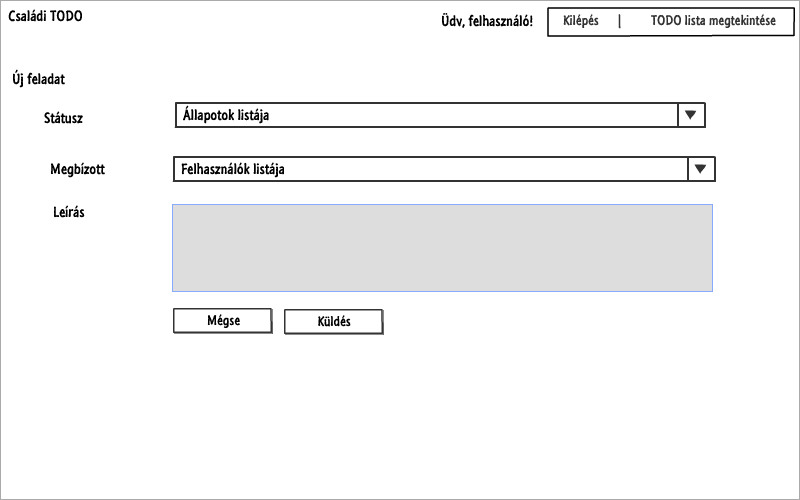

- #### Designterv
    - Főoldal
        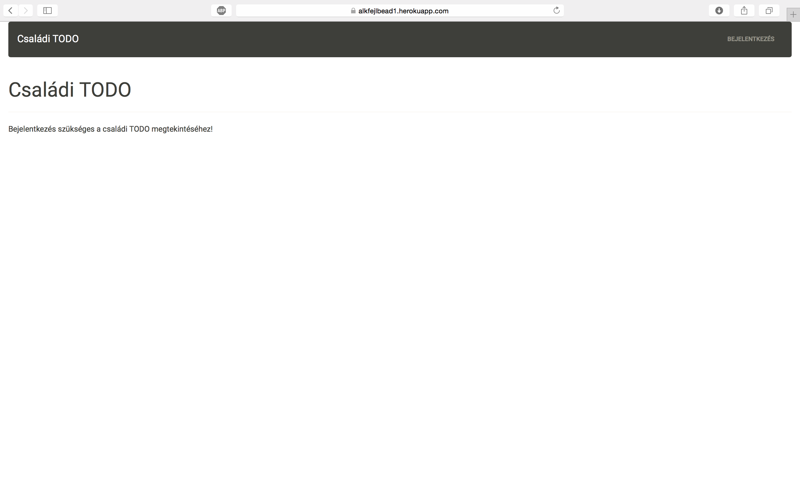
    - Bejelentkezés
        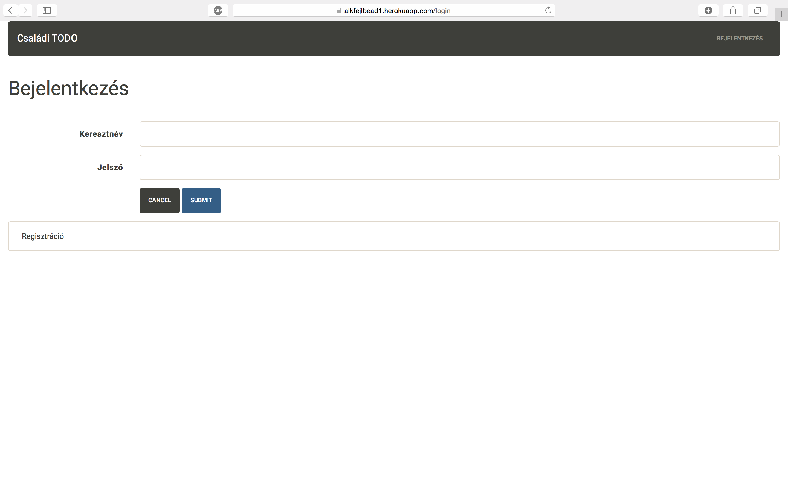
    - Regisztráció
        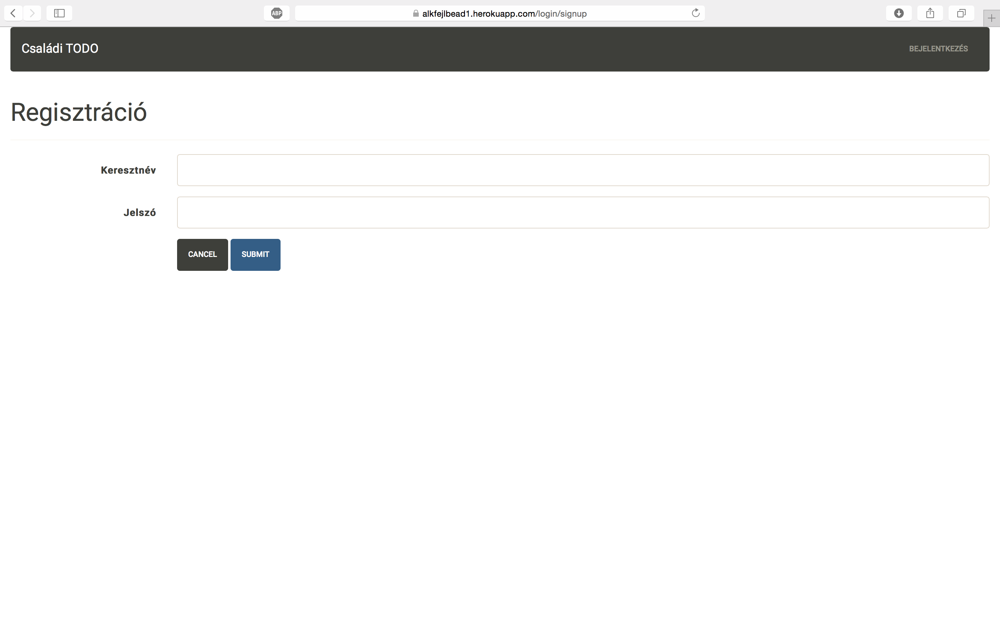
    - Feladatok
        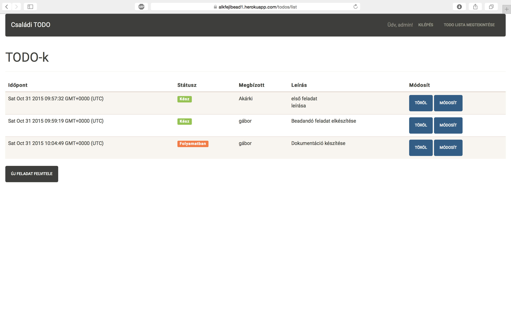
    - Új feladat
        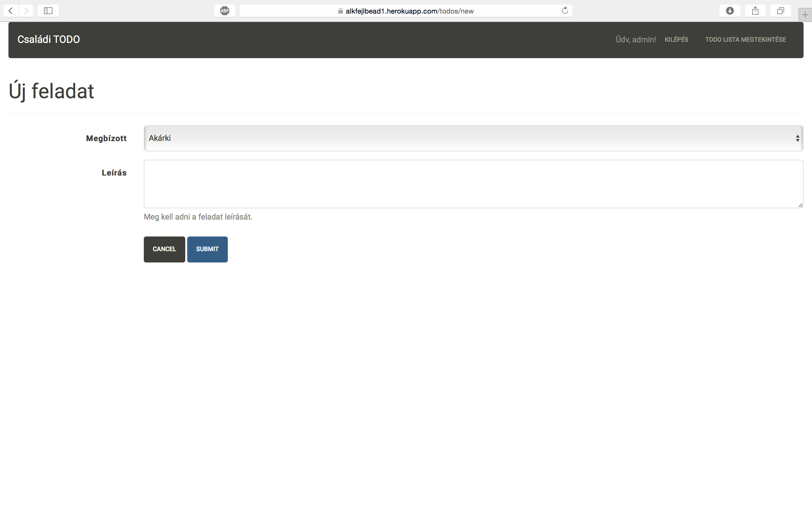
    - Feladat módosítás
        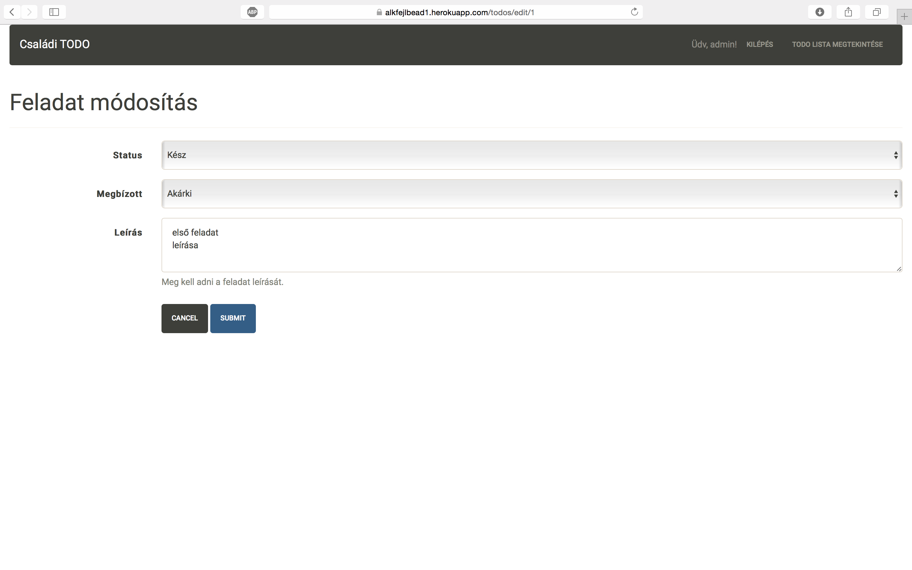

### Osztálymodell
#### Adatmodell
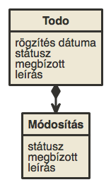
#### Adatbázisterv
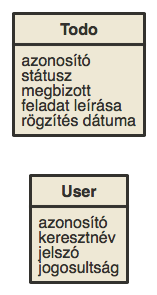
#### Állapotdiagram
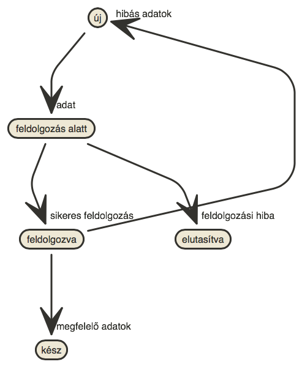

### Dinamikus működés
#### Szekvenciadiagram
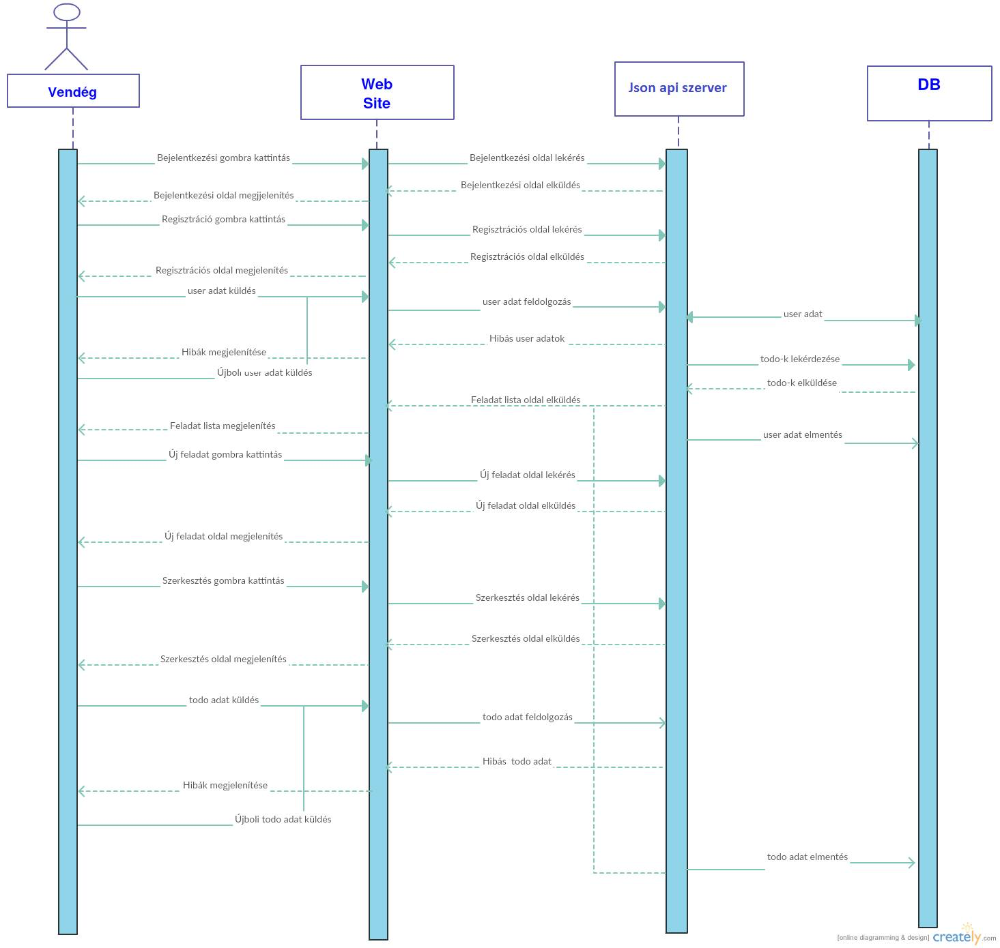

## Implementáció
### Fejlesztői környezet bemutatása
- Cloud9, felhőalapú IDE
- Heroku, felhőalapú applikációs platform
- GitHub, online verziókövető rendszer

### Könyvtárstruktúrában lévő mappák funkiójának bemutatása
- models: adatmodellek
- views: nézetek
- node_modules: szükséges modulok

## Tesztelés
Tesztelés zombie.js használatával
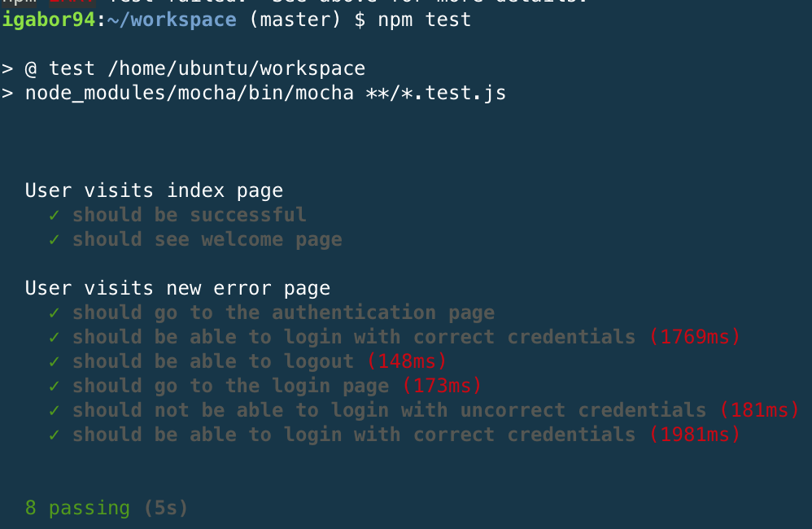

## Felhasználói dokumentáció
### A futtatáshoz ajánlott hardver-, szoftver konfiguráció
A heroku platform használata javasolt, Cloud9-al és GitHub-al együtt.
Helyileg is futtatható, ehhez további előkészületek szükségesek:
- nodejs (+ npm) telepítése
- ha herokut használunk, a heroku-toolbelt és a git telepítése

A hardverkövetelmények minimálisak.

### Telepítés lépései
Helyi gépen (vagy Cloud9-on):

- git clone https://github.com/igabor94/alkfejlbead1.git
- npm install
### A program 
Az alábbi parancsok egyikével futtatható:
- node index.js
- nodemon index.js (ajánlott)